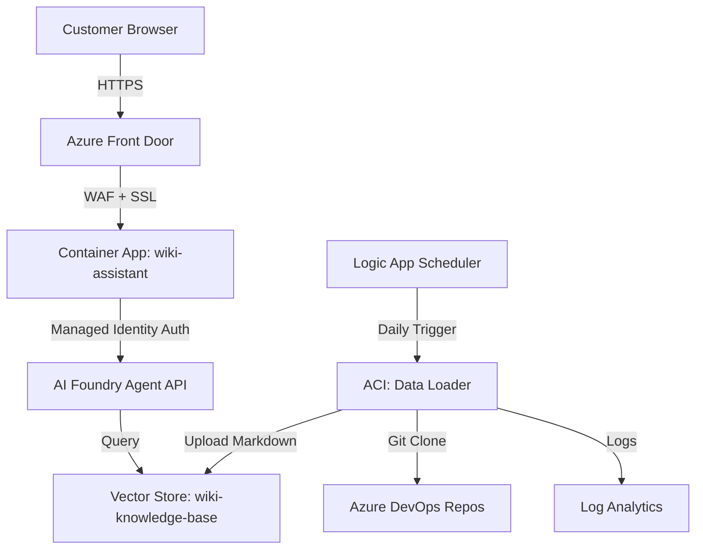

# Introduction

  

The AI Foundry Wiki Chatbot service provides an intelligent, conversational interface for querying GCR service documentation. This service enables customers to ask natural language questions about GCR services and receive instant, accurate answers powered by Azure AI Foundry, eliminating the need to manually search through wiki pages.

  

The service consists of two main components:

1. **Web Application** - A Flask-based chat interface hosted on Azure Container Apps, accessible via Azure Front Door

2. **Data Loader** - An automated backend using Azure Container Instances to keep the AI knowledge base current by ingesting wiki content daily

  

This architecture ensures customers always interact with up-to-date service information while providing a secure, scalable, and S360-compliant solution.

  

## Using the Service

  

### Access the Wiki Chatbot

  

The AI Foundry Wiki Chatbot is accessible via Azure Front Door at:

  

**🌐 https://ai-wiki-endpoint-eke4e3h6cycugsdr.b01.azurefd.net**

  

### How to Use

  

1. **Open the web interface** in your browser using the URL above

2. **Type your question** about GCR services in natural language

- Example: "How do I reserve a GPU workstation in the Sandbox?"

- Example: "What GPU clusters are available and which one has H100s?"

- Example: "How do I get access to Azure OpenAI through TRAPI?"

- Example: "What's the difference between Manifold and Volcanic Stack?"

- Example: "How do I connect to a Sandbox system with SSH?"

3. **Receive AI-powered responses** based on current wiki documentation

4. **Continue the conversation** - the AI maintains context across multiple questions

  

### Features

  

- **Natural Language Queries**: Ask questions in plain English

- **Context-Aware Responses**: AI understands GCR services and their relationships

- **Up-to-Date Information**: Knowledge base refreshed daily from wiki repositories

- **Conversational Interface**: Follow-up questions maintain conversation context

- **Secure Access**: Protected by Azure Front Door WAF and authentication

  

## SLO/SLI/KVI

  

| **SLO** | **Ensure >95% service uptime with responsive chat interface.** Complete wiki content refresh >100 files within 20 minutes daily. Provide accurate, context-aware responses to customer queries with <5 second response time. |

| --- | --- |

| **SLI** | Web application availability measured via Azure Front Door health probes and Container App metrics. Data loader success rate tracked via Logic App run history and ACI execution logs. Response time monitored through Application Insights. Customer query volume and satisfaction tracked through usage analytics. |

| **KVI** | Web Application: Active users, queries per day, average response time, user satisfaction. Data Loader: Files uploaded per run (target >100), execution success rate (>95%), refresh frequency (daily). Dashboard: [Web App Metrics](https://ms.portal.azure.com/#@microsoft.onmicrosoft.com/resource/subscriptions/f0f57942-516a-458e-81d7-7e35ff68dbf1/resourceGroups/rg-ai-wiki/providers/Microsoft.App/containerApps/wiki-assistant/overview), [Data Loader Logs](https://ms.portal.azure.com/#@microsoft.onmicrosoft.com/resource/subscriptions/f0f57942-516a-458e-81d7-7e35ff68dbf1/resourceGroups/gcr-agent-data-loader/providers/Microsoft.OperationalInsights/workspaces/dataloader-law-uvlln7tdnafw2/logs). |

  

## Overview

  

This service consists of two integrated components working together to provide an AI-powered wiki assistant:

  

### Web Application Component

- **Azure Container Apps** - Scalable Flask web application hosting the chat interface

- **Azure Front Door** - Global load balancing, WAF protection, and SSL termination

- **Azure Container Registry** - Private registry for container images

- **Application Insights** - Performance monitoring and usage analytics

- **User Assigned Managed Identity** - Secure authentication to AI Foundry APIs

  

### Data Loader Component

- **Azure Container Instance (ACI)** - Executes wiki content upload scripts in a secure environment

- **Logic App Scheduler** - Triggers daily automated execution

- **Private Storage Account** - S360-compliant storage with private endpoint access

- **Log Analytics Workspace** - Centralized logging for data loader operations

- **VNet with NAT Gateway** - Secure outbound connectivity with tagged public IP

  

### Service Architecture

  



  

This architecture provides:

  

- **Customer-Facing Service**: Secure, scalable web interface accessible via Azure Front Door

- **Automated Knowledge Updates**: Daily refresh ensures AI responses use latest documentation

- **Zero Secret Management**: Managed Identity for all authentication

- **S360 Compliance**: Private networking, WAF protection, secure storage

- **Comprehensive Monitoring**: Full observability across all components

  

## Architecture Components

  

### Data Upload Pipeline

1. **Logic App Triggers ACI**: Daily at configured time (default: midnight UTC)

2. **UAMI Authentication**: Container authenticates using managed identity

3. **Repository Cloning**: Git clones `ai_foundry_agent` and `GCRWiki` repositories

4. **Dependency Installation**: Python packages installed (requests, python-dotenv, etc.)

5. **Script Execution**: `wiki_upload.py` processes all markdown files

6. **Vector Store Upload**: Files uploaded to AI Foundry vector store via REST API

7. **Container Exit**: Execution logs preserved in Log Analytics

  

### Security Architecture (S360 Compliant)

- **Network Isolation**: VNet with dedicated ACI subnet (10.1.2.0/24)

- **Identity-Based Authentication**: User Assigned Managed Identity (Client ID: `a0d013ae-6239-4772-a2e0-ee225cd15e77`)

- **Private Storage**: Storage account with private endpoint, no public access

- **Private DNS Resolution**: `privatelink.blob.core.windows.net` for secure endpoint resolution

- **NAT Gateway**: Tagged public IP for controlled outbound access (SFI-NS2.1.1)

- **RBAC Enforcement**: Principle of least privilege access patterns

- **NSG Protection**: Network Security Group controls inbound/outbound traffic

  

## Deployment

  

### Scope

This service targets:

- **Wiki Repositories**: Azure DevOps repositories containing GCR service documentation

- **AI Foundry Project**: Vector store for knowledge base storage and AI agent access

- **Execution Frequency**: Daily automated runs via Logic App scheduler

- **Content Coverage**: All markdown files in wiki repositories (>100 files)

  

### Resource Requirements

- **Azure Container Instance**: 2 CPU cores, 4GB RAM

- **Network Bandwidth**: Minimal during execution windows (~10-20MB per run)

- **Storage**: Private storage account with blob service for future caching

- **Identity Permissions**:

- Contributor access to resource group for ACI management

- Storage Blob Data Contributor for storage account access

- Custom role for AI Foundry API access

  

## Resource Locations

  

The service is deployed across two resource groups in the **GCR Automation** subscription (f0f57942-516a-458e-81d7-7e35ff68dbf1) in the **eastus2** region.

  

### Web Application Resources

  

[rg-ai-wiki Resource Group](https://ms.portal.azure.com/#@microsoft.onmicrosoft.com/resource/subscriptions/f0f57942-516a-458e-81d7-7e35ff68dbf1/resourceGroups/rg-ai-wiki/overview) - Frontend web application and supporting infrastructure

  

**Key Resources:**

- **Container App**: `wiki-assistant` - Flask web application

- **Azure Front Door**: `ai-wiki-afd` - Global load balancing and WAF protection

- **Container Registry**: `aiwikiacr` - Private registry for container images

- **Managed Identity**: `ai-wiki-uami` - Authentication to AI Foundry APIs

  

**Service URLs:**

- **Public URL (via Azure Front Door)**: `https://ai-wiki-endpoint-eke4e3h6cycugsdr.b01.azurefd.net`

- **Container App Portal**: [wiki-assistant Overview](https://ms.portal.azure.com/#@microsoft.onmicrosoft.com/resource/subscriptions/f0f57942-516a-458e-81d7-7e35ff68dbf1/resourceGroups/rg-ai-wiki/providers/Microsoft.App/containerApps/wiki-assistant/overview)

  

### Data Loader Resources

  

[gcr-agent-data-loader Resource Group](https://ms.portal.azure.com/#@microsoft.onmicrosoft.com/resource/subscriptions/f0f57942-516a-458e-81d7-7e35ff68dbf1/resourceGroups/gcr-agent-data-loader/overview) - Backend data ingestion infrastructure

  

**Key Resources:**

- **Azure Container Instance**: `dataloader-aci` - Executes wiki upload scripts

- **Logic App**: `dataloader-scheduler` - Daily automated triggering

- **Managed Identity**: `dataloader-uami` - Authentication for Git, Azure services, and AI Foundry

- **Storage Account**: `dlsauvlln7tdnafw2` - Private storage with blob service

- **VNet**: `dataloader-vnet` (10.1.0.0/16) - S360-compliant private networking with NAT Gateway

- **Log Analytics**: `dataloader-law-uvlln7tdnafw2` - Centralized logging and monitoring

  

### Network Architecture

  

```text

VNet: dataloader-vnet (10.1.0.0/16)

├── Private Endpoint Subnet (10.1.1.0/24)

│ └── Storage Account Private Endpoint

└── ACI Subnet (10.1.2.0/24)

├── NSG: dataloader-aci-nsg

├── NAT Gateway: dataloader-natgw

└── Container: dataloader-aci

```

  

## Data Loader Process

  

The data loader container executes a fully automated pipeline to keep the AI knowledge base current:

  

1. **Bootstrap & Authentication** - Login with managed identity, configure Git credential helper, install system packages

2. **Clone Repositories** - Clone `ai_foundry_agent` (upload scripts) and wiki repositories (`GCRWiki`, `TRAPI.wiki`)

3. **Install Dependencies** - Install Python packages and configure environment

4. **Execute Upload** - Run `wiki_upload.py` to process all markdown files and upload to AI Foundry vector store

5. **Complete** - Container terminates (exit code 0), logs shipped to Log Analytics

  

The Logic App scheduler triggers this process daily, ensuring the AI agent always has access to the latest documentation.

  

## Monitoring & Operations

  

### View Execution Logs

  

```bash

# View container logs (most recent execution)

az container logs -g gcr-agent-data-loader -n dataloader-aci

  

# Query Log Analytics for historical logs (using utility script)

./tools/logquery.sh

```

  

**Log Analytics Dashboard**: [dataloader-law Logs](https://ms.portal.azure.com/#@microsoft.onmicrosoft.com/resource/subscriptions/f0f57942-516a-458e-81d7-7e35ff68dbf1/resourceGroups/gcr-agent-data-loader/providers/Microsoft.OperationalInsights/workspaces/dataloader-law-uvlln7tdnafw2/logs)

  

### Logic App Scheduler Management

  

```bash

# Enable/disable scheduler

cd infrastructure/data_loader

./enable_logic_app.sh enable # or disable

  

# Check scheduler status

./enable_logic_app.sh status

```

  

## Troubleshooting

  

### Container Issues

  

```bash

# Check container status and events

az container show -g gcr-agent-data-loader -n dataloader-aci --query instanceView.state

az container show -g gcr-agent-data-loader -n dataloader-aci --query instanceView.events

  

# View logs

az container logs -g gcr-agent-data-loader -n dataloader-aci

```

  

### Authentication Issues

  

```bash

# Verify managed identity

az identity show -g gcr-agent-data-loader -n dataloader-uami

  

# Check UAMI role assignments

az role assignment list --assignee a0d013ae-6239-4772-a2e0-ee225cd15e77

```

  

### Upload Issues

  

```bash

# Verify AI Foundry endpoint configuration

az container show -g gcr-agent-data-loader -n dataloader-aci \

--query containers[0].environmentVariables

  

# Check upload script logs

az container logs -g gcr-agent-data-loader -n dataloader-aci | grep -i "upload\|error"

```

  

For additional troubleshooting, see the [Log Analytics Dashboard](https://ms.portal.azure.com/#@microsoft.onmicrosoft.com/resource/subscriptions/f0f57942-516a-458e-81d7-7e35ff68dbf1/resourceGroups/gcr-agent-data-loader/providers/Microsoft.OperationalInsights/workspaces/dataloader-law-uvlln7tdnafw2/logs) for detailed execution history.

  

## Logic App Integration

  

The data loader is triggered daily by Azure Logic Apps using a recurrence trigger (default: midnight UTC). The Logic App uses managed identity authentication to start the container instance via HTTP action. To modify the schedule, update the Logic App trigger in the Azure Portal or via deployment parameters.

  

## S360 Compliance Features

  

This service is fully S360 compliant with dedicated VNet, private endpoints, managed identity authentication, and NAT Gateway with tagged public IP. For detailed compliance documentation, see [S360_COMPLIANCE.md](https://dev.azure.com/msresearch/MSR%20Engineering/_git/ai_foundry_agent?path=/infrastructure/S360_COMPLIANCE.md).

  

**Key Features:**

  

- Network isolation with NSG-protected subnets and default outbound access disabled (SFI 1.05, SFI 2.6.1)

- Private-only storage with private endpoints and private DNS resolution

- User Assigned Managed Identity for all authentication (no secrets stored)

- Centralized logging via Log Analytics integration

  

## Service Lifetime

  

This service will exist until one of the following conditions is met:

  

### Sunset Criteria

1. **GCR Program Retirement**: When the GCR program is officially sunset

2. **Improved Service**: A better service takes its place, such as:

- Corp-wide wiki search agent with broader coverage

- Azure AI Studio native wiki integration

- Centralized Microsoft knowledge base solution

3. **Cost/Value Analysis**: Customer usage does not justify service expense

- Low query volume to AI agent

- Minimal time savings compared to operational costs

- Alternative solutions provide better ROI

  

### Service Evaluation Metrics

- AI agent query volume and user satisfaction

- Time saved vs. manual wiki search

- Service operational costs (compute, storage, networking)

- Availability and reliability metrics

  

## Deployment Guide

  

### Prerequisites

  

1. Azure subscription with appropriate permissions

2. AI Foundry project with API access

3. Azure DevOps access for Git repository cloning

  

### Initial Deployment

  

```bash

cd infrastructure/data_loader

./deploy_dataloader.sh

```

  

This creates all required infrastructure including VNet, storage, managed identity, ACI, Logic App scheduler, and Log Analytics workspace. Key configuration parameters can be set in `infrastructure/config.env` (AI Foundry endpoint, CPU/memory allocation, scheduler frequency).

  

## Related Documentation

  

- **Infrastructure Deployment**: [infrastructure/data_loader/README.md](https://dev.azure.com/msresearch/MSR%20Engineering/_git/ai_foundry_agent?path=/infrastructure/data_loader/README.md)

- **S360 Compliance Details**: [infrastructure/S360_COMPLIANCE.md](https://dev.azure.com/msresearch/MSR%20Engineering/_git/ai_foundry_agent?path=/infrastructure/S360_COMPLIANCE.md)

- **Utility Tools**: [tools/README.md](https://dev.azure.com/msresearch/MSR%20Engineering/_git/ai_foundry_agent?path=/tools/README.md)

- **Wiki Upload Scripts**: [wiki_content_upload/README.md](https://dev.azure.com/msresearch/MSR%20Engineering/_git/ai_foundry_agent?path=/wiki_content_upload/README.md)

  

## Support & Contact

  

For issues or questions about the AI Foundry Data Loader service:

  

1. **Check Logs**: Review container execution logs via Log Analytics

2. **Monitor Dashboard**: Check [Data Loader Logs Dashboard](https://ms.portal.azure.com/#@microsoft.onmicrosoft.com/resource/subscriptions/f0f57942-516a-458e-81d7-7e35ff68dbf1/resourceGroups/gcr-agent-data-loader/providers/Microsoft.OperationalInsights/workspaces/dataloader-law-uvlln7tdnafw2/logs)

3. **Run Diagnostics**: Use troubleshooting commands in this document

4. **Contact Team**: Reach out to GCR automation team via standard channels