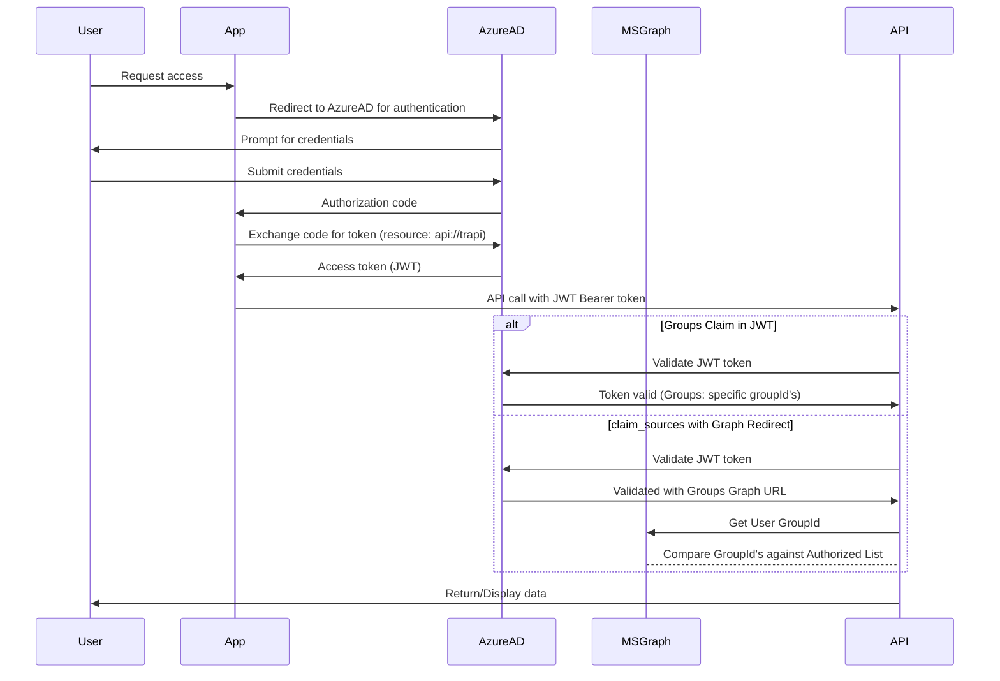

# TRAPI - Translation Research API Platform Interface

## Comprehensive Technical Documentation

**Version:** 1.0
**Last Updated:** December 2025
**Repository:** trapi-snapshot
**Current Branch:** feature/batch-UITweaks

---

## Table of Contents

1. [Executive Summary](#1-executive-summary)
2. [Project Overview](#2-project-overview)
3. [Architecture Overview](#3-architecture-overview)
4. [Repository Structure](#4-repository-structure)
5. [Frontend Application (TRAPI UI)](#5-frontend-application-trapi-ui)
6. [Infrastructure as Code (Bicep)](#6-infrastructure-as-code-bicep)
7. [API Management Layer](#7-api-management-layer)
8. [Database Layer (Cosmos DB)](#8-database-layer-cosmos-db)
9. [Batch Processing System](#9-batch-processing-system)
10. [Authentication & Authorization](#10-authentication--authorization)
11. [Deployment & CI/CD](#11-deployment--cicd)
12. [Configuration Management](#12-configuration-management)
13. [Monitoring & Observability](#13-monitoring--observability)
14. [Security Controls](#14-security-controls)
15. [Example Suite & Testing](#15-example-suite--testing)
16. [PowerShell Scripts & Utilities](#16-powershell-scripts--utilities)
17. [API Reference](#17-api-reference)
18. [Troubleshooting Guide](#18-troubleshooting-guide)
19. [Change Control & Versioning](#19-change-control--versioning)
20. [Appendices](#20-appendices)

---

## 1. Executive Summary

### 1.1 What is TRAPI?

**TRAPI** (Translation Research API Platform Interface) is a comprehensive enterprise platform designed to provide secure, managed access to Azure OpenAI and other AI services within Microsoft Research. The platform serves as a centralized gateway that:

- **Manages API Access**: Controls who can access which AI models and capabilities
- **Provides Self-Service**: Enables users to discover, test, and consume AI APIs
- **Handles Batch Processing**: Allows large-scale batch inference operations
- **Enforces Security**: Implements role-based access control and identity management
- **Tracks Usage**: Monitors and logs all API consumption for billing and analytics

### 1.2 Key Capabilities

| Capability | Description |
|------------|-------------|
| **API Gateway** | Azure API Management fronting Azure OpenAI services |
| **Self-Service Portal** | React-based web UI for API discovery and management |
| **Batch Processing** | Upload-based batch inference for large workloads |
| **Identity Management** | Azure AD integration with managed service identity support |
| **Health Monitoring** | Real-time health checks and status reporting |
| **Code Examples** | Multi-language example generation for API consumers |
| **Admin Console** | Full CRUD operations for APIs, backends, and resource pools |

### 1.3 Target Audience

- **Researchers**: Access AI models for research projects
- **Developers**: Integrate AI capabilities into applications
- **Administrators**: Manage APIs, access control, and resource allocation
- **Security Teams**: Audit access and ensure compliance

---

## 2. Project Overview

### 2.1 Technology Stack

#### Frontend
| Technology | Version | Purpose |
|------------|---------|---------|
| React | 18.3.1 | UI Framework |
| TypeScript | 5.5.4 | Type Safety |
| Vite | 7.1.12 | Build Tool |
| Fluent UI | 9.68.3 | Microsoft Design System |
| React Query | 5.51.0 | Data Fetching & Caching |
| React Router | 6.26.2 | Client-side Routing |
| MSAL Browser | 3.25.0 | Azure AD Authentication |
| Axios | 1.7.7 | HTTP Client |

#### Infrastructure
| Technology | Purpose |
|------------|---------|
| Azure API Management | API Gateway & Policy Enforcement |
| Azure Front Door | Global Load Balancing & WAF |
| Azure Static Web Apps | Frontend Hosting |
| Azure Cosmos DB | Configuration Database |
| Azure Key Vault | Secrets Management |
| Azure Event Hub | Event Streaming & Logging |
| Azure Redis Enterprise | Caching Layer |
| Azure Log Analytics | Monitoring & Analytics |
| Application Insights | APM & Diagnostics |

#### DevOps
| Technology | Purpose |
|------------|---------|
| Bicep | Infrastructure as Code |
| Azure DevOps | CI/CD Pipelines |
| PowerShell | Automation Scripts |
| Python | Example Suite & Testing |

### 2.2 Environments

| Environment | Purpose | Resource Group | API Base URL |
|-------------|---------|----------------|--------------|
| **Development** | Testing & Development | `trapi-dev` | `https://apim-aad4cuppaec54.azure-api.net/tmds` |
| **Production** | Live Service | `trapi-prod` | `https://apim-3qmvxqds5s632.azure-api.net/tmds` |

### 2.3 Key URLs

| Service | Development | Production |
|---------|-------------|------------|
| TRAPI UI | `https://dev-trapi-config.azurestaticapps.net` | `https://trapi-config.azurestaticapps.net` |
| Batch API | `https://dev-trapi.research.microsoft.com/batch` | `https://trapi.research.microsoft.com/batch` |
| Developer Portal | Via Front Door | Via Front Door |

---

## 3. Architecture Overview

### 3.1 High-Level Architecture Diagram

```
┌─────────────────────────────────────────────────────────────────────────────┐
│                              END USERS                                        │
│  ┌──────────┐  ┌──────────┐  ┌──────────┐  ┌──────────┐  ┌──────────┐        │
│  │ Browser  │  │   CLI    │  │  Python  │  │   C#     │  │PowerShell│        │
│  └────┬─────┘  └────┬─────┘  └────┬─────┘  └────┬─────┘  └────┬─────┘        │
└───────┼─────────────┼─────────────┼─────────────┼─────────────┼──────────────┘
        │             │             │             │             │
        ▼             ▼             ▼             ▼             ▼
┌─────────────────────────────────────────────────────────────────────────────┐
│                         AZURE FRONT DOOR (WAF)                               │
│  • Global Load Balancing    • Rate Limiting    • DDoS Protection             │
└─────────────────────────────────────────────┬───────────────────────────────┘
                                              │
        ┌─────────────────────────────────────┼─────────────────────────────────┐
        │                                     │                                 │
        ▼                                     ▼                                 │
┌───────────────────────┐         ┌───────────────────────────────────────────┐
│   STATIC WEB APPS     │         │           AZURE API MANAGEMENT             │
│   (TRAPI UI)          │         │  ┌─────────────────────────────────────┐  │
│                       │         │  │           GLOBAL POLICIES           │  │
│  • React SPA          │         │  │  • Front Door ID Validation         │  │
│  • MSAL Auth          │         │  │  • Token Logging                    │  │
│  • Admin Console      │         │  │  • Rate Limiting                    │  │
│  • Batch UI           │         │  └─────────────────────────────────────┘  │
│                       │         │                    │                       │
└───────────────────────┘         │  ┌─────────────────┼─────────────────┐    │
                                  │  │                 │                 │    │
                                  │  ▼                 ▼                 ▼    │
                                  │ ┌───────┐     ┌─────────┐     ┌────────┐ │
                                  │ │ TMDS  │     │  Batch  │     │ OpenAI │ │
                                  │ │  API  │     │   API   │     │   API  │ │
                                  │ └───┬───┘     └────┬────┘     └────┬───┘ │
                                  └─────┼──────────────┼───────────────┼─────┘
                                        │              │               │
        ┌───────────────────────────────┼──────────────┼───────────────┼───────┐
        │                               ▼              ▼               ▼       │
        │  ┌─────────────────┐  ┌──────────────┐  ┌────────────────────────┐  │
        │  │   COSMOS DB     │  │   STORAGE    │  │    AZURE OPENAI        │  │
        │  │  (trapiDB)      │  │   ACCOUNT    │  │    BACKENDS            │  │
        │  │                 │  │              │  │                        │  │
        │  │ • APIs          │  │ • Batch      │  │ • GPT-4                │  │
        │  │ • Backends      │  │   Files      │  │ • GPT-3.5              │  │
        │  │ • Pools         │  │ • Results    │  │ • Embeddings           │  │
        │  │ • Security      │  │              │  │ • DALL-E               │  │
        │  └─────────────────┘  └──────────────┘  └────────────────────────┘  │
        │                                                                      │
        │                          AZURE BACKBONE                              │
        └──────────────────────────────────────────────────────────────────────┘
```

### 3.2 Data Flow Diagram

```
┌─────────────────────────────────────────────────────────────────────────────┐
│                            AUTHENTICATION FLOW                               │
│                                                                              │
│  User ──► Azure AD (MSAL) ──► Access Token ──► API Management ──► Backend   │
│                                    │                    │                    │
│                                    │                    ▼                    │
│                                    │              ┌──────────┐               │
│                                    │              │ Cosmos DB│               │
│                                    │              │ Security │               │
│                                    │              │  Check   │               │
│                                    │              └──────────┘               │
│                                    ▼                    │                    │
│                             ┌───────────┐               │                    │
│                             │ MS Graph  │◄──────────────┘                    │
│                             │ (Groups)  │                                    │
│                             └───────────┘                                    │
└─────────────────────────────────────────────────────────────────────────────┘
```

### 3.3 Component Interactions

```
┌──────────────────────────────────────────────────────────────────────────────┐
│                           BATCH PROCESSING FLOW                               │
│                                                                               │
│  1. Upload File                                                               │
│     Browser ──► TRAPI UI ──► Batch API ──► Storage Account                   │
│                                                │                              │
│  2. Create Job                                 │                              │
│     Browser ──► TRAPI UI ──► Batch API ──► Job Queue                         │
│                                                │                              │
│  3. Process                                    ▼                              │
│     Job Queue ──► Batch Processor ──► Azure OpenAI                           │
│                         │                                                     │
│  4. Store Results       │                                                     │
│     Batch Processor ──► Storage Account                                       │
│                                                                               │
│  5. Download Results                                                          │
│     Browser ◄── TRAPI UI ◄── Batch API ◄── Storage Account                  │
└──────────────────────────────────────────────────────────────────────────────┘
```

---

## 4. Repository Structure

### 4.1 Root Directory Layout

```
trapi-snapshot/
├── .azure/                          # Azure DevOps pipeline definitions
│   ├── azure-pipelines-configui.yml # TRAPI UI build/deploy pipeline
│   ├── azure-pipelines-healthcheck.yml
│   └── pipeline/
│       ├── examples-operations.yaml
│       └── simpletext.yaml
│
├── api-management-policies/         # APIM policy definitions
│   ├── global.xml                   # Global policies (Front Door validation)
│   ├── token-usage-logger-to-eventhub.xml
│   ├── std-api-key-config.xml
│   ├── msri.xml
│   ├── genai-testing.xml
│   ├── Batch Processor API.openapi.yaml
│   ├── apis/                        # Per-API policies
│   ├── batch_operations/            # Batch processing policies
│   ├── extensions/                  # Policy extensions
│   ├── fragments/                   # Reusable policy fragments
│   ├── tmds/                        # TMDS service policies
│   └── examples/                    # Example policies
│
├── cosmosDb/                        # Database artifacts
│   ├── storedProcedures/            # Server-side stored procedures
│   │   ├── spGetAllowedGroups.js
│   │   ├── spGetRateLimits.js
│   │   ├── spDeployedModels.js
│   │   ├── spGetBackends.js
│   │   └── ...
│   ├── triggers/                    # Database triggers
│   ├── DEPLOYMENT_SUMMARY.md
│   └── QUICK_START.md
│
├── docs/                            # Documentation
│   ├── api-change-control.md
│   ├── api-publishing-guide.md
│   ├── apim-reposync.md
│   ├── deploymentorder.md
│   ├── frontdoor-waf-ratelimit.md
│   ├── keyvault-certificates.md
│   ├── OAuth-Flow.md
│   ├── PoSH-TRAPI.md
│   ├── trapi-ui.md
│   └── change_plans/                # Change planning documents
│       ├── AddBatchtoAPIEndpoints.md
│       ├── BatchInterfaces/
│       ├── configDB/
│       ├── PassThru/
│       └── UI/
│
├── example-suite/                   # Code examples and tests
│   ├── extra-examples/              # Advanced examples
│   ├── helper-scripts/              # Utility scripts
│   ├── operations/                  # API operation examples
│   │   └── fallback/               # Fallback operation examples
│   ├── templates/                   # Code templates
│   └── tests/                       # Test suites
│       ├── backendCapabilityTests/
│       └── examplesTests/
│
├── etc/                             # Miscellaneous configuration
│
├── modules/                         # Bicep infrastructure modules
│   ├── api-management.bicep
│   ├── api.bicep
│   ├── apim-loggers.bicep
│   ├── container-app.bicep          # NEW: Container App deployment
│   ├── cosmosdb.bicep
│   ├── event-hub.bicep
│   ├── front-door.bicep
│   ├── key-vault.bicep
│   ├── log-analytics-workspace.bicep
│   ├── network.bicep
│   ├── redis.bicep
│   └── redis-noconnect.bicep
│
├── scripts/                         # PowerShell automation scripts
│   ├── Manage-ApimApiRevisions.ps1
│   ├── set-TRAPIBackendAzInfo.ps1
│   ├── deploy-cosmosDB.ps1
│   ├── Copy-TRAPIOpenAIToPassThru.ps1
│   ├── remove-orphanedAPIRecords.ps1
│   ├── replicate-cosmosDB.ps1
│   ├── Test-TRAPIConfigs.ps1
│   ├── Update-TRAPIDevEnv.ps1
│   └── setup-python-envs.py
│
├── self-service-ui/                 # Legacy/alternate UI project
│
├── trapi-ui/                        # Primary React application
│   ├── src/
│   │   ├── pages/                   # Route components
│   │   ├── components/              # Reusable UI components
│   │   ├── hooks/                   # Custom React hooks
│   │   ├── services/                # API clients
│   │   ├── contexts/                # React contexts
│   │   ├── config/                  # Configuration files
│   │   ├── App.tsx                  # Main app component
│   │   └── main.tsx                 # Entry point
│   ├── staticwebapp.config.json     # SWA configuration
│   ├── package.json
│   ├── tsconfig.json
│   └── vite.config.ts
│
├── main.bicep                       # Main infrastructure template
├── deleteRG.sh                      # Resource group cleanup script
├── es-metadata.yml                  # Project metadata
├── pip.conf                         # Python package configuration (Linux)
└── pip.ini                          # Python package configuration (Windows)
```

### 4.2 File Count by Type

| Category | Files | Description |
|----------|-------|-------------|
| TypeScript/TSX | ~52 | Frontend components and logic |
| Bicep | 16 | Infrastructure templates |
| XML | ~50 | APIM policies |
| JavaScript | 12 | CosmosDB stored procedures |
| PowerShell | 8 | Automation scripts |
| Markdown | ~40 | Documentation |
| Python | ~100+ | Examples and tests |
| YAML | 5 | Pipeline definitions |

---

## 5. Frontend Application (TRAPI UI)

### 5.1 Application Overview

The TRAPI UI is a modern React single-page application (SPA) that provides:

- **Self-service portal** for API discovery and access
- **Batch processing interface** for large-scale inference
- **Admin console** for API and backend management
- **Real-time health monitoring** dashboard

### 5.2 Technology Stack Details

```json
{
  "name": "self-service-ui",
  "engines": { "node": ">=20.19.0" },
  "dependencies": {
    "@azure/msal-browser": "^3.25.0",
    "@azure/msal-react": "^2.0.18",
    "@fluentui/react-components": "^9.68.3",
    "@fluentui/react-icons": "^2.0.234",
    "@tanstack/react-query": "^5.51.0",
    "axios": "^1.7.7",
    "react": "18.3.1",
    "react-dom": "18.3.1",
    "react-router-dom": "^6.26.2"
  },
  "devDependencies": {
    "@vitejs/plugin-react": "^4.3.2",
    "eslint": "^9.9.0",
    "typescript": "^5.5.4",
    "vite": "^7.1.12"
  }
}
```

### 5.3 Page Structure

#### 5.3.1 User-Facing Pages

| Route | Component | Description |
|-------|-----------|-------------|
| `/` | `Welcome.tsx` | Landing page for unauthenticated users |
| `/myaccess` | `MyAccess.tsx` | List of APIs the user has access to |
| `/models` | `Models.tsx` | Browse available AI models |
| `/examples` | `Examples.tsx` | Generate code examples |
| `/managemsi` | `ManageMSI.tsx` | Manage Managed Service Identities |
| `/batch` | `Batch.tsx` | Batch processing interface |
| `/debug` | `Debug.tsx` | Troubleshooting and diagnostics |

#### 5.3.2 Admin Pages

| Route | Component | Description |
|-------|-----------|-------------|
| `/admin` | `AdminDashboard.tsx` | Admin overview dashboard |
| `/admin/apis` | `ApisPage.tsx` | CRUD operations for APIs |
| `/admin/backends` | `BackendsPage.tsx` | Backend configuration |
| `/admin/resource-pools` | `ResourcePoolsPage.tsx` | Resource pool management |

### 5.4 Component Architecture

```
src/
├── pages/                           # Top-level route components
│   ├── Batch.tsx                    # Batch processing main page
│   │   └── Uses: FileUpload, BatchControls, BatchProgress, BatchJobsList
│   ├── Models.tsx                   # AI model browser
│   ├── Examples.tsx                 # Code example generator
│   ├── MyAccess.tsx                 # User's accessible APIs
│   ├── ManageMSI.tsx                # Identity management
│   ├── Debug.tsx                    # Diagnostics
│   ├── Welcome.tsx                  # Landing page
│   └── admin/
│       ├── AdminDashboard.tsx       # Admin overview
│       ├── ApisPage.tsx             # API management
│       ├── BackendsPage.tsx         # Backend management
│       └── ResourcePoolsPage.tsx    # Pool management
│
├── components/                      # Reusable components
│   ├── FileUpload.tsx               # Drag-and-drop file upload
│   ├── ApiSelectors.tsx             # API/Version dropdowns
│   ├── BatchControls.tsx            # Start/Cancel/Refresh buttons
│   ├── BatchJobsList.tsx            # Jobs history table
│   ├── BatchProgress.tsx            # Progress indicator
│   ├── BatchStatus.tsx              # Status display
│   └── forms/
│       ├── ApiForm.tsx              # API form fields
│       ├── ApiFormModal.tsx         # API create/edit modal
│       ├── BackendForm.tsx          # Backend form fields
│       ├── BackendFormModal.tsx     # Backend create/edit modal
│       ├── ResourcePoolForm.tsx     # Pool form fields
│       └── ResourcePoolFormModal.tsx
│
├── hooks/                           # Custom React hooks
│   ├── useMsalAuth.ts               # Azure AD authentication
│   ├── useBatchApi.ts               # Batch API operations
│   ├── useBatchWorkflow.ts          # Batch workflow orchestration
│   ├── useAllBatchJobs.ts           # Fetch batch jobs
│   ├── useApi.ts                    # Generic API wrapper
│   ├── useMyAccessData.ts           # User access data
│   ├── useHealthCheckData.ts        # Health check status
│   └── useSwaAuth.ts                # Static Web Apps auth
│
├── services/                        # API client implementations
│   ├── healthcheck.ts               # Health check parsing
│   ├── tmds.ts                      # TMDS API client
│   ├── cancel_job.ts                # Job cancellation
│   └── api/                         # Additional API utilities
│
├── contexts/
│   └── AppContext.tsx               # Global app state
│
└── config/
    ├── msal.ts                      # MSAL configuration
    ├── api.ts                       # API endpoints
    └── trapi.ts                     # Batch configuration
```

### 5.5 Key Hooks Documentation

#### 5.5.1 useMsalAuth

```typescript
// Purpose: Handles Azure AD authentication via MSAL
// Location: src/hooks/useMsalAuth.ts

interface UseMsalAuth {
  isAuthenticated: boolean;
  user: AccountInfo | null;
  getToken: () => Promise<string>;
  getUserOid: () => string;
  login: () => Promise<void>;
  logout: () => void;
}
```

#### 5.5.2 useBatchWorkflow

```typescript
// Purpose: Orchestrates the complete batch processing workflow
// Location: src/hooks/useBatchWorkflow.ts

interface BatchWorkflowState {
  isProcessing: boolean;
  message: string;
  currentStep: string;  // 'Uploading file...', 'Waiting for file processing...', etc.
  jobId: string;
  jobStatus: string;
  fileId: string;
}

interface UseBatchWorkflow extends BatchWorkflowState {
  runBatchWorkflow: (
    file: File,
    selectedApiPath: string,
    selectedApiVersion: string,
    selectedEnvironment: BatchEnvironment
  ) => Promise<void>;
  cancelCurrentJob: (
    selectedApiPath: string,
    selectedApiVersion: string,
    selectedEnvironment: BatchEnvironment
  ) => Promise<void>;
  resetWorkflow: () => void;
}
```

**Workflow Steps:**
1. **Upload File** - Upload JSONL file to storage
2. **Wait for Processing** - Poll file status until processed
3. **Submit Batch Job** - Create batch job with file reference
4. **Wait for Completion** - Poll job status until complete
5. **Download Results** - Retrieve and download output file

#### 5.5.3 useBatchApi

```typescript
// Purpose: Low-level batch API operations
// Location: src/hooks/useBatchApi.ts

interface UseBatchApi {
  uploadFile: (file: File, config: BatchConfig) => Promise<string>;
  waitForFileProcessing: (
    fileId: string,
    config: BatchConfig,
    onStatusUpdate: (status: string) => void
  ) => Promise<void>;
  submitBatchJob: (fileId: string, config: BatchConfig) => Promise<string>;
  waitForJobCompletion: (
    jobId: string,
    config: BatchConfig,
    onStatusUpdate: (status: string) => void
  ) => Promise<string>;
  getJobResults: (
    jobId: string,
    config: BatchConfig,
    originalFileName: string
  ) => Promise<string>;
}
```

### 5.6 Configuration Files

#### 5.6.1 MSAL Configuration

```typescript
// src/config/msal.ts
export const msalConfig = {
  auth: {
    clientId: import.meta.env.VITE_AAD_CLIENT_ID || '56e558e2-30f5-489f-96da-8353f7c9064b',
    authority: import.meta.env.VITE_AAD_AUTHORITY ||
               'https://login.microsoftonline.com/72f988bf-86f1-41af-91ab-2d7cd011db47',
    redirectUri: window.location.origin,
  },
  cache: {
    cacheLocation: 'localStorage',
    storeAuthStateInCookie: false,
  },
};

export const loginRequest = {
  scopes: [import.meta.env.VITE_AAD_SCOPES || 'api://trapi/.default'],
};
```

#### 5.6.2 Batch Environment Configuration

```typescript
// src/config/trapi.ts
export type BatchEnvironment = 'prod' | 'dev';

const BATCH_ENVIRONMENTS: Record<BatchEnvironment, { baseUrl: string }> = {
  prod: { baseUrl: 'https://trapi.research.microsoft.com/batch' },
  dev: { baseUrl: 'https://dev-trapi.research.microsoft.com/batch' },
};

export function getBatchBaseUrl(env: BatchEnvironment): string {
  return BATCH_ENVIRONMENTS[env].baseUrl;
}
```

#### 5.6.3 Static Web App Configuration

```json
// staticwebapp.config.json
{
  "routes": [
    { "route": "/admin/*", "allowedRoles": ["trapi-admin-alt"] },
    { "route": "/api/*", "allowedRoles": ["anonymous"] }
  ],
  "responseOverrides": {
    "401": { "redirect": "/.auth/login/aad", "statusCode": 302 },
    "403": { "rewrite": "/index.html", "statusCode": 200 }
  },
  "roles": [
    {
      "name": "trapi-admin-alt",
      "rules": [
        {
          "claim": "groups",
          "values": ["eea9dc15-95f3-47fd-8250-5206012caf57"]
        }
      ]
    }
  ],
  "navigationFallback": {
    "rewrite": "/index.html",
    "exclude": ["/assets/*", "*.{css,scss,js,png,jpg,ico,svg,woff,woff2}"]
  },
  "globalHeaders": {
    "X-Content-Type-Options": "nosniff",
    "X-Frame-Options": "DENY",
    "Content-Security-Policy": "default-src 'self'; script-src 'self' 'unsafe-inline' 'unsafe-eval'; style-src 'self' 'unsafe-inline'; img-src 'self' data: https:; connect-src 'self' https://*.azure-api.net https://*.azurestaticapps.net https://login.microsoftonline.com;"
  }
}
```

### 5.7 State Management

The application uses a combination of:

1. **React Query** - Server state caching and synchronization
2. **React Context** - Global app settings (AppContext)
3. **Local State** - Component-level state with useState
4. **localStorage** - Persistent settings and batch workflow state

```typescript
// AppContext - Global settings
interface AppSettings {
  selectedEnvironment: 'development' | 'production';
  debugMode: boolean;
}

// Persisted to localStorage under 'trapi-ui-app'
```

### 5.8 Build Commands

```bash
# Development
cd trapi-ui
npm install        # Install dependencies
npm run dev        # Start dev server (http://localhost:5174)

# Production
npm run build      # Build for production (output: dist/)
npm run preview    # Preview production build

# Quality
npm run lint       # Run ESLint
```

---

## 6. Infrastructure as Code (Bicep)

### 6.1 Main Template Overview

The `main.bicep` file orchestrates the deployment of the complete TRAPI infrastructure.

```bicep
// main.bicep - Key Parameters

@allowed(['Test', 'Production'])
param deploymentType string

param location string = resourceGroup().location

@allowed(['Premium', 'Developer'])
param apiManagementSku string = (deploymentType == 'Production') ? 'Premium' : 'Developer'

param apiManagementPublisherName string = 'Microsoft Research'
param apiManagementPublisherEmail string = 'tnrllmproxy@microsoft.com'

@description('Provide the URL of the Azure Open AI service.')
param apiServiceUrl string

@allowed(['Standard_AzureFrontDoor', 'Premium_AzureFrontDoor'])
param frontDoorSkuName string = 'Premium_AzureFrontDoor'

param developerPortalIdentity string = 'e54b44d5-9b6f-47b3-a3ce-34a2c566558b'

@secure()
param developerPortalIdentitySecret string
```

### 6.2 Module Dependency Graph

```
main.bicep
    │
    ├── logAnalyticsWorkspace (log-analytics-workspace.bicep)
    │       └── Outputs: insightResourceId, insightsInstrumentationKey
    │
    ├── network (network.bicep)
    │       └── Outputs: apiManagementSubnetResourceId, vnetName
    │
    ├── apiManagement (api-management.bicep)
    │       ├── Depends on: network, logAnalyticsWorkspace
    │       └── Outputs: apiManagementProxyHostName, apiManagementMSI
    │
    ├── frontDoor (front-door.bicep)
    │       ├── Depends on: apiManagement
    │       └── Outputs: frontDoorId
    │
    ├── keyVault (key-vault.bicep)
    │       ├── Depends on: apiManagement
    │       └── Grants access to APIM identity
    │
    ├── eventHub (event-hub.bicep)
    │       ├── Depends on: apiManagement
    │       └── Outputs: eventHubNamespaceName
    │
    ├── apimLoggers (apim-loggers.bicep)
    │       ├── Depends on: eventHub, apiManagement
    │       └── Configures Event Hub logger
    │
    ├── redisCache (redis.bicep)
    │       ├── Depends on: network, apiManagement
    │       └── Redis Enterprise with private endpoint
    │
    ├── api (api.bicep)
    │       ├── Depends on: apiManagement
    │       └── Registers Azure OpenAI API
    │
    └── cosmos (cosmosdb.bicep)
            ├── Depends on: apiManagement
            └── Creates trapiDB database
```

### 6.3 Network Module

```bicep
// modules/network.bicep

// Creates:
// - Virtual Network (10.0.0.0/16)
// - API Management Subnet (10.0.0.0/24)
// - Network Security Group with APIM-required rules

var nsgRules = [
  { name: 'AllowAPIMGateway', port: 443 }
  { name: 'AllowAPIMManagement', port: 3443 }
  { name: 'AllowAPIMLoadBalancer', port: 6390 }
  // ... additional APIM-specific rules
]

// Service Endpoints enabled:
// - Microsoft.Storage
// - Microsoft.Sql
// - Microsoft.EventHub
// - Microsoft.ServiceBus
// - Microsoft.KeyVault
```

### 6.4 API Management Module

```bicep
// modules/api-management.bicep

// Key Resources Created:

resource apiManagementServicePublic 'Microsoft.ApiManagement/service@2023-03-01-preview' = {
  name: serviceName
  location: location
  sku: { name: skuName, capacity: skuCount }
  identity: { type: 'SystemAssigned' }
  properties: {
    publisherName: publisherName
    publisherEmail: publisherEmail
    virtualNetworkType: virtualNetworkType
    virtualNetworkConfiguration: { subnetResourceId: subnetResourceId }
    developerPortalStatus: developerPortalStatus
    apiVersionConstraint: { minApiVersion: '2019-12-01' }
  }
}

// AAD Identity Provider for Developer Portal
resource portalIdentityProvider 'Microsoft.ApiManagement/service/identityProviders@2023-03-01-preview' = {
  parent: apiManagementServicePublic
  name: 'aad'
  properties: {
    clientId: developerPortalIdentity
    type: 'aad'
    authority: 'login.windows.net'
    allowedTenants: aadAllowedTenents
    clientLibrary: 'MSAL-2'
    clientSecret: developerPortalIdentitySecret
  }
}

// Named Values for configuration
// - AppInsights-Logger-Credentials
// - Trapi-Config-Storage-Account
// - Trapi-Environment
```

### 6.5 Cosmos DB Module

```bicep
// modules/cosmosdb.bicep

// Creates:
// - Cosmos DB Account (SQL/Core API)
// - Database: trapiDB
// - Role assignments for APIM MSI

resource cosmosDbAccount 'Microsoft.DocumentDB/databaseAccounts@2024-05-15' = {
  name: 'cosmos-${uniqueString(resourceGroup().id)}'
  location: location
  kind: 'GlobalDocumentDB'
  identity: { type: 'SystemAssigned' }
  properties: {
    databaseAccountOfferType: 'Standard'
    consistencyPolicy: { defaultConsistencyLevel: 'Session' }
    disableLocalAuth: true  // RBAC only
    // ... networking configuration
  }
}
```

### 6.6 Container App Module (New)

```bicep
// modules/container-app.bicep
// Uses Azure Verified Module (AVM) for Container Apps

module containerApp 'br/public:avm/res/app/container-app:0.19.0' = {
  name: '${uniqueString(deployment().name, location)}-containerApp'
  params: {
    name: name
    location: location
    environmentResourceId: environmentResourceId

    containers: [{
      name: 'main-container'
      image: containerImage
      resources: { cpu: json(cpu), memory: memory }
      env: environmentVariables
    }]

    ingressExternal: ingressExternal
    ingressTargetPort: containerPort

    scaleSettings: {
      minReplicas: minReplicas
      maxReplicas: maxReplicas
    }

    activeRevisionsMode: 'Single'
  }
}
```

### 6.7 Deployment Commands

```bash
# Deploy to a resource group
az deployment group create \
  --resource-group <resource-group-name> \
  --template-file main.bicep \
  --parameters deploymentType=Production \
               apiServiceUrl='https://your-openai.openai.azure.com/openai' \
               developerPortalIdentitySecret='<secret>'

# Validate template
az deployment group validate \
  --resource-group <resource-group-name> \
  --template-file main.bicep \
  --parameters @parameters.json
```

---

## 7. API Management Layer

### 7.1 Policy Architecture

APIM uses a hierarchical policy structure:

```
Global Policies (applied to all APIs)
    └── Product Policies (applied to product subscribers)
        └── API Policies (applied to specific API)
            └── Operation Policies (applied to specific operations)
```

### 7.2 Global Policy

```xml
<!-- api-management-policies/global.xml -->
<policies>
  <inbound>
    <!-- Validate requests come through Front Door -->
    <check-header
      name="X-Azure-FDID"
      failed-check-httpcode="403"
      failed-check-error-message="TRAPI: Invalid FrontDoor request. See (https://aka.ms/trapi/errors)"
      ignore-case="false">
      <value>{{FrontDoorId}}</value>
    </check-header>
  </inbound>
  <backend>
    <forward-request />
  </backend>
</policies>
```

### 7.3 Token Usage Logging Policy

```xml
<!-- api-management-policies/token-usage-logger-to-eventhub.xml -->
<policies>
  <inbound>
    <!-- Extract and store request context -->
    <set-variable name="requestTimestamp" value="@(DateTime.UtcNow)" />
    <set-variable name="requestId" value="@(context.RequestId)" />
  </inbound>
  <outbound>
    <!-- Log token usage to Event Hub -->
    <log-to-eventhub logger-id="ApimEventhub">@{
      return new JObject(
        new JProperty("requestId", context.Variables["requestId"]),
        new JProperty("timestamp", context.Variables["requestTimestamp"]),
        new JProperty("operation", context.Operation.Id),
        new JProperty("api", context.Api.Name),
        new JProperty("responseCode", context.Response.StatusCode),
        // Token usage metrics extracted from response
        new JProperty("promptTokens", context.Response.Body.As<JObject>()["usage"]["prompt_tokens"]),
        new JProperty("completionTokens", context.Response.Body.As<JObject>()["usage"]["completion_tokens"])
      ).ToString();
    }</log-to-eventhub>
  </outbound>
</policies>
```

### 7.4 API Structure

| API Name | Path | Description |
|----------|------|-------------|
| `azure-openai-service-api` | `/` | Main Azure OpenAI passthrough |
| `tmds` | `/tmds` | TRAPI Management Data Service |
| `batch-processor-api` | `/batch` | Batch processing endpoints |

### 7.5 TMDS API Endpoints

| Endpoint | Method | Description |
|----------|--------|-------------|
| `/myaccess` | GET | List APIs accessible to current user |
| `/models` | GET | List available models for an API |
| `/examples` | GET | Generate code examples |
| `/managemsi` | GET/POST | Manage identities for APIs |
| `/idcheck/{id}` | GET | Validate an identity |
| `/healthcheckreports` | GET | Get health check reports |

---

## 8. Database Layer (Cosmos DB)

### 8.1 Database Configuration

| Property | Value |
|----------|-------|
| **Account Type** | SQL (Core) API |
| **Database Name** | `trapiDB` |
| **Consistency Level** | Session |
| **Authentication** | RBAC only (local auth disabled) |
| **Backup Policy** | Configurable per deployment type |

### 8.2 Stored Procedures

#### 8.2.1 spGetAllowedGroups

**Purpose:** Retrieves security groups and managed identities allowed to access an API.

```javascript
function spGetAllowedGroups(apiPath) {
  // 1. Check for ALIAS records (API path aliases)
  // 2. Query for API document using resolved path
  // 3. Extract security groups and managed identities
  // 4. Filter by valid date ranges (startDate/endDate)
  // 5. Return deduplicated arrays

  return {
    securityGroups: ["guid1", "guid2", ...],
    managedIdentities: ["guid3", "guid4", ...]
  };
}
```

#### 8.2.2 spGetRateLimits

**Purpose:** Retrieves rate limits configured for a deployment.

#### 8.2.3 spDeployedModels

**Purpose:** Lists all deployed models for an API path.

#### 8.2.4 spGetBackends

**Purpose:** Retrieves backend configurations for an API.

### 8.3 Document Schema

#### API Document

```json
{
  "id": "unique-id",
  "type": "RUNTIMECI",
  "ci": "API",
  "apiPath": "/openai",
  "displayName": "Azure OpenAI",
  "security": {
    "groups": [
      {
        "id": "aad-group-guid",
        "name": "TRAPI Users",
        "startDate": "2024-01-01T00:00:00Z",
        "endDate": null
      }
    ],
    "identities": [
      {
        "id": "msi-object-id",
        "name": "MyApp MSI",
        "startDate": "2024-01-01T00:00:00Z"
      }
    ]
  },
  "backends": ["backend-1", "backend-2"],
  "resourcePool": "default-pool"
}
```

#### Backend Document

```json
{
  "id": "backend-id",
  "type": "RUNTIMECI",
  "ci": "BACKEND",
  "name": "eastus-openai",
  "endpoint": "https://eastus-openai.openai.azure.com/openai",
  "region": "eastus",
  "models": [
    {
      "id": "gpt-4",
      "deployment": "gpt-4-deployment",
      "version": "0613"
    }
  ]
}
```

### 8.4 Stored Procedure Index

| Procedure | Purpose |
|-----------|---------|
| `spGetAllowedGroups.js` | Get security groups/identities for API |
| `spGetRateLimits.js` | Get rate limits for deployment |
| `spDeployedModels.js` | List deployed models |
| `spGetBackends.js` | Get backend configurations |
| `getEndpointUsage.js` | Get usage statistics |
| `getLatestTokenUsage.js` | Get recent token consumption |
| `cleanupDuplicates.js` | Remove duplicate records |
| `updateSecurityFields.js` | Update security configurations |
| `upsertTokenUsage.js` | Update token usage records |
| `generatePathMappings.js` | Generate API path mappings |
| `getModelDataForApiPath.js` | Get model data for API |
| `getDeploymentRateLimits.js` | Get deployment rate limits |

---

## 9. Batch Processing System

### 9.1 Overview

TRAPI Batch is how **researchers** run large numbers of requests asynchronously (e.g., thousands of chat-completions calls) without manually scripting retries/polling.

**Important:** Researchers typically submit batch jobs via the **TRAPI UI → “Batch Processing”** page by uploading a `.jsonl` file; the UI and APIM policies handle identity headers. The “Batch feature” described elsewhere (e.g., APIM change plans) is about **platform wiring**, not the researcher submission experience.

### 9.2 Researcher Submission Flow (TRAPI UI)

1. Open TRAPI UI and navigate to **Batch Processing**.
2. Select:
   - **Environment** (dev/prod)
   - **API version**
   - **API path** (this becomes `x-trapi-api-path` under the hood)
3. Upload a `.jsonl` file (each line is a single request).
4. Click **Submit Batch Job**.
5. Monitor status (queued/validating/in_progress/finalizing → completed/failed/cancelled).
6. Download the output `.jsonl` results when complete.

### 9.3 Researcher-Facing Batch API (via APIM)

These are the endpoints the TRAPI UI calls (base URL: `https://{env}.trapi.research.microsoft.com/batch`).

**Authentication / headers (researcher-facing):**
- `Authorization: Bearer <TRAPI AAD access token>`
- `x-trapi-api-path: /<apiPath>` (**required**) — indicates which TRAPI API surface the batch should execute against.
- `x-ms-user-oid: <oid>` (optional; the UI sends it when available)
- **Do not send `x-trapi-on-behalf-of`** from clients. APIM policies derive the effective user identity from the authenticated principal.

#### Upload File

```http
POST /files?api-version=2024-10-21
Content-Type: multipart/form-data

form-data:
  file: <your-input.jsonl>
  purpose: batch
```

Response: returns a file identifier (often `id`; some integrations may return `input_file_id`). Use that value as the `input_file_id` when creating the batch job.

#### Create Batch Job

```http
POST /batches?api-version=2024-10-21
Content-Type: application/json

{
  "input_file_id": "<file-id>",
  "endpoint": "/chat/completions",
  "completion_window": "PT2H",
  "metadata": null
}
```

Notes:
- The backend OpenAPI requires `endpoint` to start with `/` (pattern `^/.*`). If you see validation errors, ensure the leading slash is present.

#### Get Batch Status

```http
GET /batches/{jobId}?api-version=2024-10-21
```

#### Cancel Batch Job

```http
POST /batches/{jobId}/cancel?api-version=2024-10-21
```

#### List My Batch Jobs

```http
GET /batches?api-version=2024-10-21&limit=100
```

#### Download Results

```http
GET /files/{outputFileId}/content?api-version=2024-10-21
```

Where `outputFileId` typically comes from `BatchDto.output_file_id` returned by `GET /batches/{jobId}`.

### 9.4 Backend Routing Notes

For the underlying backend contract, see `api-management-policies\Batch Processor API.openapi.yaml` (which documents backend routes like `/trapi/files` and `/trapi/batches`). In practice, APIM maps the researcher-facing `/files` and `/batches` calls to backend `/batch/trapi/*` routes.

### 9.5 Workflow State Machine

```
                    ┌───────────────┐
                    │   INITIAL     │
                    └───────┬───────┘
                            │ Upload File
                            ▼
                    ┌───────────────┐
                    │   UPLOADING   │
                    └───────┬───────┘
                            │ File Uploaded
                            ▼
                    ┌───────────────┐
        ┌──────────►│  PROCESSING   │◄──────────┐
        │           └───────┬───────┘           │
        │                   │ File Processed    │
        │                   ▼                   │
        │           ┌───────────────┐           │
        │           │  SUBMITTING   │           │
        │           └───────┬───────┘           │
        │                   │ Job Created       │
        │                   ▼                   │
        │           ┌───────────────┐           │
        │   Poll    │  IN_PROGRESS  │   Poll    │
        └───────────┤               ├───────────┘
                    └───────┬───────┘
                            │
         ┌──────────────────┼──────────────────┐
         │                  │                  │
         ▼                  ▼                  ▼
┌───────────────┐  ┌───────────────┐  ┌───────────────┐
│   COMPLETED   │  │    FAILED     │  │   CANCELLED   │
└───────────────┘  └───────────────┘  └───────────────┘
```

### 9.6 JSONL Input Format

```jsonl
{"custom_id": "request-1", "method": "POST", "url": "/v1/chat/completions", "body": {"model": "gpt-4", "messages": [{"role": "user", "content": "Hello"}]}}
{"custom_id": "request-2", "method": "POST", "url": "/v1/chat/completions", "body": {"model": "gpt-4", "messages": [{"role": "user", "content": "World"}]}}
```

### 9.7 JSONL Output Format

```jsonl
{"id": "batch_req_1", "custom_id": "request-1", "response": {"status_code": 200, "body": {...}}, "error": null}
{"id": "batch_req_2", "custom_id": "request-2", "response": {"status_code": 200, "body": {...}}, "error": null}
```

---

## 10. Authentication & Authorization

### 10.1 Authentication Flow



### 10.2 Azure AD Configuration

| Component | Value |
|-----------|-------|
| **Client ID (TRAPI UI)** | `56e558e2-30f5-489f-96da-8353f7c9064b` |
| **Authority** | `https://login.microsoftonline.com/72f988bf-86f1-41af-91ab-2d7cd011db47` |
| **Scopes** | `api://trapi/.default` |
| **OAuth Backend App** | `cb707faf-cdc3-431f-9ca7-6b9902465127` (TRAPI OAuth Backend) |
| **Developer Portal App** | `e54b44d5-9b6f-47b3-a3ce-34a2c566558b` (TnRLLMProxy) |

### 10.3 App Registrations

#### TRAPI UI App Registration
- **Purpose**: Frontend authentication
- **Type**: Single-Page Application (SPA)
- **Redirect URIs**:
  - `https://trapi-config.azurestaticapps.net`
  - `https://dev-trapi-config.azurestaticapps.net`
  - `http://localhost:5174` (development)

#### TRAPI OAuth Backend
- **Purpose**: Backend API authentication
- **Type**: Web API
- **API Permissions**:
  - `User.Read` (MS Graph)
  - `Directory.Read` (MS Graph)

### 10.4 Role-Based Access Control

#### Admin Role Requirements

```json
{
  "name": "trapi-admin-alt",
  "requirements": {
    "claim": "groups",
    "values": ["eea9dc15-95f3-47fd-8250-5206012caf57"]
  }
}
```

#### Access Levels

| Role | Access |
|------|--------|
| **Anonymous** | Welcome page only |
| **Authenticated** | MyAccess, Models, Examples, Batch, ManageMSI |
| **Admin** | All above + /admin/* routes |

### 10.5 Token Storage

| Storage Location | Content | Security |
|------------------|---------|----------|
| localStorage | MSAL token cache | Per-domain isolation |
| Memory (React Query) | API response cache | Cleared on page refresh |
| localStorage | App settings | Non-sensitive preferences |

### 10.6 Security Headers

```http
X-Content-Type-Options: nosniff
X-Frame-Options: DENY
Content-Security-Policy:
  default-src 'self';
  script-src 'self' 'unsafe-inline' 'unsafe-eval';
  style-src 'self' 'unsafe-inline';
  img-src 'self' data: https:;
  connect-src 'self'
    https://*.azure-api.net
    https://*.azurestaticapps.net
    https://login.microsoftonline.com;
```

---

## 11. Deployment & CI/CD

### 11.1 Pipeline Overview

```yaml
# .azure/azure-pipelines-configui.yml

trigger:
  paths:
    include:
      - trapi-ui/**
      - .azure/azure-pipelines-configui.yml

pool:
  vmImage: 'ubuntu-latest'

variables:
  app_location: '/trapi-ui'
  output_location: 'dist'
  azureServiceConnection: 'TRAPI Service Automation'
```

### 11.2 Pipeline Stages

```
┌─────────────────────────────────────────────────────────────┐
│                    BUILD & DEPLOY PIPELINE                   │
├─────────────────────────────────────────────────────────────┤
│                                                              │
│  1. CHECKOUT                                                 │
│     └── Clone repository with submodules                    │
│                                                              │
│  2. SETUP NODE.JS                                            │
│     └── Install Node.js 25.x                                │
│                                                              │
│  3. NPM AUTHENTICATE                                         │
│     └── Authenticate with Azure Artifacts feed              │
│                                                              │
│  4. GENERATE CONFIGURATION                                   │
│     ├── Determine environment from branch:                  │
│     │   ├── main → Production                               │
│     │   └── other → Development                             │
│     └── Generate .env file with:                            │
│         ├── VITE_API_BASE_URL                               │
│         ├── VITE_ENVIRONMENT                                │
│         ├── VITE_AAD_CLIENT_ID                              │
│         ├── VITE_AAD_AUTHORITY                              │
│         └── VITE_AAD_SCOPES                                 │
│                                                              │
│  5. BUILD                                                    │
│     ├── npm ci (install dependencies)                       │
│     └── npm run build (production build)                    │
│                                                              │
│  6. DEPLOY                                                   │
│     ├── Get SWA deployment token                            │
│     └── Deploy using SWA CLI                                │
│                                                              │
│  7. VERIFY                                                   │
│     └── Check deployment status                             │
│                                                              │
└─────────────────────────────────────────────────────────────┘
```

### 11.3 Environment Configuration

| Branch | Environment | Resource Group | Static Web App |
|--------|-------------|----------------|----------------|
| `main` | Production | `trapi-prod` | `trapi-config` |
| `*` (other) | Development | `trapi-dev` | `dev-trapi-config` |

### 11.4 Infrastructure Deployment Sequence

Per `docs/deploymentorder.md`:

1. **Deploy BICEP template**
   ```bash
   az deployment group create \
     --resource-group <resource-group-name> \
     --template-file main.bicep \
     --parameters @parameters.json
   ```

2. **Create client secret in TnRAPIProxy**
   - Set appropriate expiry (short for dev/test)
   - Document the deployment association

3. **Get Developer Portal Redirect URIs**
   - APIM instance URI: `https://<apim-name>.developer.azure-api.net/signin`
   - Front Door URI: `https://<front-door-name>.azurefd.net/signin`

4. **Add URIs to App Registration**
   - Navigate to Azure AD > App Registrations > TnRAPIProxy
   - Add redirect URIs under Authentication

### 11.5 Deployment Scripts

| Script | Purpose |
|--------|---------|
| `deploy-cosmosDB.ps1` | Deploy Cosmos DB and stored procedures |
| `Manage-ApimApiRevisions.ps1` | Manage API revisions in APIM |
| `set-TRAPIBackendAzInfo.ps1` | Configure backend Azure information |
| `Test-TRAPIConfigs.ps1` | Validate configuration settings |
| `Update-TRAPIDevEnv.ps1` | Update development environment |
| `replicate-cosmosDB.ps1` | Replicate data between Cosmos DB instances |
| `remove-orphanedAPIRecords.ps1` | Clean up orphaned records |
| `Copy-TRAPIOpenAIToPassThru.ps1` | Copy API configurations |

---

## 12. Configuration Management

### 12.1 Environment Variables

#### Build-Time Variables (Vite)

| Variable | Description | Dev Value | Prod Value |
|----------|-------------|-----------|------------|
| `VITE_API_BASE_URL` | TMDS API endpoint | `https://apim-aad4cuppaec54.azure-api.net/tmds` | `https://apim-3qmvxqds5s632.azure-api.net/tmds` |
| `VITE_ENVIRONMENT` | Environment identifier | `development` | `production` |
| `VITE_AAD_CLIENT_ID` | Azure AD client ID | `56e558e2-30f5-489f-96da-8353f7c9064b` | Same |
| `VITE_AAD_AUTHORITY` | Azure AD authority | Microsoft tenant | Same |
| `VITE_AAD_SCOPES` | OAuth scopes | `api://trapi/.default` | Same |

#### Runtime Configuration

```typescript
// src/config/api.ts
export const API_CONFIG = {
  baseUrl: import.meta.env.VITE_API_BASE_URL,
  environment: import.meta.env.VITE_ENVIRONMENT,
};
```

### 12.2 APIM Named Values

| Name | Display Name | Purpose |
|------|--------------|---------|
| `AppInsightsKey` | `AppInsights-Logger-Credentials` | Application Insights key |
| `trapi-config-storage-account` | `Trapi-Config-Storage-Account` | Storage account hostname |
| `trapi-environment` | `Trapi-Environment` | Resource group name |
| `FrontDoorId` | `FrontDoorId` | Front Door identifier |

### 12.3 Local Storage Keys

| Key | Content | Purpose |
|-----|---------|---------|
| `trapi-ui-app` | `{ environment, debugMode }` | App preferences |
| `batch-workflow-state` | `{ jobId, jobStatus, fileId }` | Batch workflow persistence |
| `msal.*` | MSAL token cache | Authentication tokens |

---

## 13. Monitoring & Observability

### 13.1 Log Analytics Workspace

```bicep
// modules/log-analytics-workspace.bicep
resource logAnalyticsWorkspace 'Microsoft.OperationalInsights/workspaces@2022-10-01' = {
  name: logAnalyticsName
  location: location
  properties: {
    sku: { name: 'PerGB2018' }
    retentionInDays: 30
  }
}
```

### 13.2 Application Insights

- **Purpose**: APM for API Management
- **Features**:
  - Request tracking
  - Dependency tracking
  - Exception logging
  - Performance metrics

### 13.3 Event Hub Logging

```xml
<!-- Token usage logging to Event Hub -->
<log-to-eventhub logger-id="ApimEventhub">
  @{
    return new JObject(
      new JProperty("requestId", context.RequestId),
      new JProperty("timestamp", DateTime.UtcNow),
      new JProperty("operation", context.Operation.Id),
      new JProperty("api", context.Api.Name),
      new JProperty("promptTokens", ...),
      new JProperty("completionTokens", ...)
    ).ToString();
  }
</log-to-eventhub>
```

### 13.4 Health Checks

- **Endpoint**: `/healthcheckreports`
- **Frequency**: Configurable via pipeline
- **Metrics**:
  - API availability
  - Backend connectivity
  - Response times
  - Error rates

---

## 14. Security Controls

### 14.1 Network Security

| Control | Implementation |
|---------|----------------|
| **Virtual Network** | APIM deployed in VNet (10.0.0.0/16) |
| **Subnet Isolation** | APIM subnet (10.0.0.0/24) |
| **NSG Rules** | APIM-specific ingress/egress rules |
| **Service Endpoints** | Storage, SQL, EventHub, ServiceBus, KeyVault |
| **Private Endpoints** | Redis, Cosmos DB |

### 14.2 Front Door WAF

| Feature | Configuration |
|---------|---------------|
| **SKU** | Premium_AzureFrontDoor |
| **DDoS Protection** | Enabled |
| **Rate Limiting** | Configurable per endpoint |
| **Origin Validation** | X-Azure-FDID header check |

### 14.3 API Management Security

```xml
<!-- Global policy - Front Door validation -->
<check-header
  name="X-Azure-FDID"
  failed-check-httpcode="403"
  failed-check-error-message="TRAPI: Invalid FrontDoor request">
  <value>{{FrontDoorId}}</value>
</check-header>
```

### 14.4 Key Vault

| Configuration | Value |
|---------------|-------|
| **SKU** | Standard |
| **Soft Delete** | Enabled (Production only) |
| **Access Policy** | APIM managed identity |
| **Permissions** | Keys: list, get; Secrets: list, get |

### 14.5 Cosmos DB Security

| Control | Implementation |
|---------|----------------|
| **Authentication** | RBAC only (local auth disabled) |
| **Network** | VNet service endpoints + private endpoint |
| **Identity** | System-assigned managed identity |

### 14.6 Static Web Apps Security

| Header | Value |
|--------|-------|
| `X-Content-Type-Options` | nosniff |
| `X-Frame-Options` | DENY |
| `Content-Security-Policy` | Restrictive CSP |

### 14.7 Data Classification

| Data Type | Classification | Storage |
|-----------|----------------|---------|
| Access tokens | Sensitive | Browser localStorage (encrypted) |
| User email/UPN | PII | Memory only (display) |
| API configuration | Internal | Cosmos DB (RBAC protected) |
| Batch files | Variable | Azure Storage (encrypted at rest) |

---

## 15. Example Suite & Testing

### 15.1 Directory Structure

```
example-suite/
├── extra-examples/                  # Advanced examples
│   ├── chat_with_headers/          # Custom header examples
│   ├── oauth/                      # OAuth authentication
│   └── images/                     # Image generation
│
├── helper-scripts/                  # Utility scripts
│   ├── analyze_logs.py
│   └── generate_reports.py
│
├── operations/                      # API operation examples
│   ├── chat_completions/
│   ├── embeddings/
│   ├── completions/
│   ├── audio/
│   │   ├── speech/
│   │   ├── transcription/
│   │   └── translation/
│   ├── assistants/
│   ├── images/
│   ├── vision/
│   └── fallback/                   # Version-specific fallbacks
│
├── templates/                       # Code templates
│   ├── python/
│   ├── powershell/
│   └── bash/
│
└── tests/
    ├── backendCapabilityTests/     # Backend capability testing
    │   └── acr-task.yaml
    └── examplesTests/              # Example validation tests
        └── acr-task.yaml
```

### 15.2 Supported Languages

| Language | Template Location | Description |
|----------|-------------------|-------------|
| Python | `templates/python/` | Full SDK examples |
| PowerShell | `templates/powershell/` | Native PS examples |
| Bash/cURL | `templates/bash/` | REST API examples |

### 15.3 Capability Coverage

| Capability | Examples |
|------------|----------|
| Chat Completions | Standard, streaming, JSON mode |
| Embeddings | Text embeddings |
| Audio | Speech synthesis, transcription, translation |
| Images | DALL-E generation |
| Vision | Image analysis |
| Assistants | Assistant API operations |
| Function Calling | Tool use examples |

### 15.4 Running Tests

```bash
# Backend capability tests
cd example-suite/tests/backendCapabilityTests
# Configured via acr-task.yaml for Azure Container Registry

# Example validation tests
cd example-suite/tests/examplesTests
# Configured via acr-task.yaml
```

---

## 16. PowerShell Scripts & Utilities

### 16.1 Script Inventory

| Script | Purpose | Usage |
|--------|---------|-------|
| `Manage-ApimApiRevisions.ps1` | Manage API revisions | `.\Manage-ApimApiRevisions.ps1 -ResourceGroup trapi-prod -ApimName apim-xxx` |
| `set-TRAPIBackendAzInfo.ps1` | Set backend Azure info | `.\set-TRAPIBackendAzInfo.ps1 -BackendName eastus-openai` |
| `deploy-cosmosDB.ps1` | Deploy Cosmos DB | `.\deploy-cosmosDB.ps1 -ResourceGroup trapi-prod` |
| `Copy-TRAPIOpenAIToPassThru.ps1` | Copy API configs | `.\Copy-TRAPIOpenAIToPassThru.ps1 -Source api1 -Dest api2` |
| `remove-orphanedAPIRecords.ps1` | Cleanup orphaned records | `.\remove-orphanedAPIRecords.ps1 -DryRun` |
| `replicate-cosmosDB.ps1` | Replicate database | `.\replicate-cosmosDB.ps1 -Source dev -Target prod` |
| `Test-TRAPIConfigs.ps1` | Validate configurations | `.\Test-TRAPIConfigs.ps1 -Environment dev` |
| `Update-TRAPIDevEnv.ps1` | Update dev environment | `.\Update-TRAPIDevEnv.ps1` |

### 16.2 Common Operations

#### Update API Revision
```powershell
.\Manage-ApimApiRevisions.ps1 `
  -ResourceGroup "trapi-prod" `
  -ApimServiceName "apim-3qmvxqds5s632" `
  -ApiId "azure-openai-service-api" `
  -NewRevisionDescription "Updated rate limits"
```

#### Deploy Cosmos DB Updates
```powershell
.\deploy-cosmosDB.ps1 `
  -ResourceGroup "trapi-prod" `
  -AccountName "cosmos-xxx" `
  -DatabaseName "trapiDB"
```

---

## 17. API Reference

### 17.1 TMDS API

#### GET /myaccess

Returns list of APIs accessible to the authenticated user.

**Request:**
```http
GET /tmds/myaccess HTTP/1.1
Authorization: Bearer <token>
```

**Response:**
```json
{
  "apis": [
    {
      "apiPath": "/openai",
      "displayName": "Azure OpenAI",
      "healthStatus": "healthy",
      "backends": ["eastus-openai", "westus-openai"]
    }
  ]
}
```

#### GET /models

Returns available models for an API.

**Request:**
```http
GET /tmds/models?apiPath=/openai HTTP/1.1
Authorization: Bearer <token>
```

**Response:**
```json
{
  "models": [
    {
      "id": "gpt-4",
      "name": "GPT-4",
      "deployment": "gpt-4-deployment",
      "capabilities": ["chat", "function_calling"]
    }
  ]
}
```

#### GET /examples

Generate code examples for API operations.

**Request:**
```http
GET /tmds/examples?apiPath=/openai&language=python&operation=chat HTTP/1.1
Authorization: Bearer <token>
```

**Response:**
```json
{
  "code": "import openai\n\nclient = openai.OpenAI(...)",
  "language": "python",
  "operation": "chat"
}
```

### 17.2 Batch API

See [Section 9: Batch Processing System](#9-batch-processing-system) for complete API reference.

---

## 18. Troubleshooting Guide

### 18.1 Common Issues

#### Authentication Failures

**Symptom:** "401 Unauthorized" or login loop

**Solutions:**
1. Clear browser localStorage
2. Sign out and sign back in
3. Verify Azure AD group membership
4. Check token expiry

#### Batch Job Stuck

**Symptom:** Job status shows "in_progress" indefinitely

**Solutions:**
1. Check file format (valid JSONL)
2. Verify API path and version
3. Check backend availability
4. Cancel and retry during off-peak hours

#### Admin Section Not Visible

**Symptom:** `/admin` routes return 403 or redirect

**Solutions:**
1. Sign out and sign back in (token refresh)
2. Verify membership in admin group: `eea9dc15-95f3-47fd-8250-5206012caf57`
3. Check SWA `/.auth/me` for roles

### 18.2 Debug Page Features

The `/debug` page provides:
- Token inspection
- API connectivity tests
- Health check details
- Environment information

### 18.3 Log Locations

| Component | Log Location |
|-----------|--------------|
| TRAPI UI | Browser console |
| APIM | Application Insights |
| Batch Processor | Event Hub / Log Analytics |
| Cosmos DB | Azure Portal metrics |

### 18.4 Health Check Interpretation

| Status | Meaning | Action |
|--------|---------|--------|
| `healthy` | All backends responding | None |
| `degraded` | Some backends slow/unavailable | Monitor |
| `unhealthy` | Major outage | Escalate |

---

## 19. Change Control & Versioning

### 19.1 API Versioning

Per `docs/api-change-control.md`:

- **Revisions**: Non-breaking changes (bug fixes, new operations)
  - Identified by `;rev=1`, `;rev=2`, etc.
  - Safe to apply without consumer impact

- **Versions**: Breaking changes (behavior modifications)
  - Identified by `v1`, `v2`, etc.
  - Requires consumer opt-in

### 19.2 Deployment Versioning

| Component | Versioning Strategy |
|-----------|---------------------|
| TRAPI UI | Git branch → Environment |
| Infrastructure | Bicep templates in source control |
| APIM Policies | Repository sync |
| Cosmos DB | Stored procedure versioning |

### 19.3 Release Process

1. **Development**
   - Feature branches
   - Deploy to dev environment automatically

2. **Testing**
   - PR review required
   - Automated tests must pass

3. **Production**
   - Merge to `main`
   - Automatic deployment to prod
   - Post-deployment verification

---

## 20. Appendices

### 20.1 Glossary

| Term | Definition |
|------|------------|
| **APIM** | Azure API Management |
| **MSAL** | Microsoft Authentication Library |
| **MSI** | Managed Service Identity |
| **SWA** | Static Web Apps |
| **TMDS** | TRAPI Management Data Service |
| **OID** | Object Identifier (Azure AD) |
| **JSONL** | JSON Lines format |
| **WAF** | Web Application Firewall |

### 20.2 Key Azure Resource Naming

| Resource Type | Naming Pattern | Example |
|---------------|----------------|---------|
| API Management | `apim-{uniqueString}` | `apim-3qmvxqds5s632` |
| Key Vault | `kv-{uniqueString}` | `kv-abc123def456` |
| Log Analytics | `law-{uniqueString}` | `law-xyz789` |
| App Insights | `appIn-{uniqueString}` | `appIn-abc123` |
| Event Hub | `ehns-{uniqueString}` | `ehns-def456` |
| Front Door | `afd-{purpose}-{uniqueString}` | `afd-proxy-ghi789` |
| Cosmos DB | `cosmos-{uniqueString}` | `cosmos-jkl012` |

### 20.3 Useful Links

| Resource | URL |
|----------|-----|
| Azure OpenAI Docs | https://learn.microsoft.com/azure/ai-services/openai |
| APIM Policies | https://learn.microsoft.com/azure/api-management/api-management-policies |
| Bicep Reference | https://learn.microsoft.com/azure/azure-resource-manager/bicep |
| Fluent UI | https://react.fluentui.dev |
| MSAL React | https://learn.microsoft.com/azure/active-directory/develop/msal-overview |

### 20.4 Contact Information

- **Product/Engineering**: TRAPI Team
- **Support Email**: tnrllmproxy@microsoft.com
- **Security Inquiries**: TRAPI Team

---

## Document History

| Version | Date | Author | Changes |
|---------|------|--------|---------|
| 1.0 | December 2025 | TRAPI Team | Initial comprehensive documentation |

---

*This document is auto-generated and should be updated when significant changes are made to the repository.*
